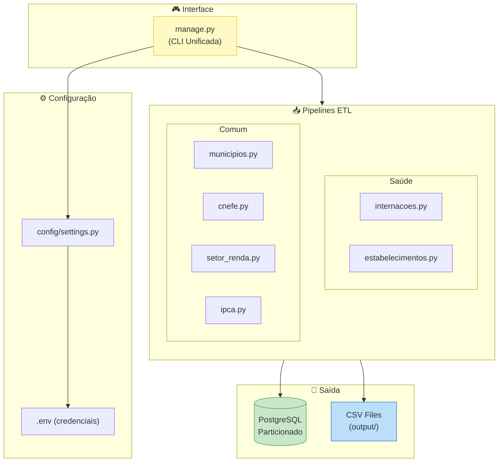
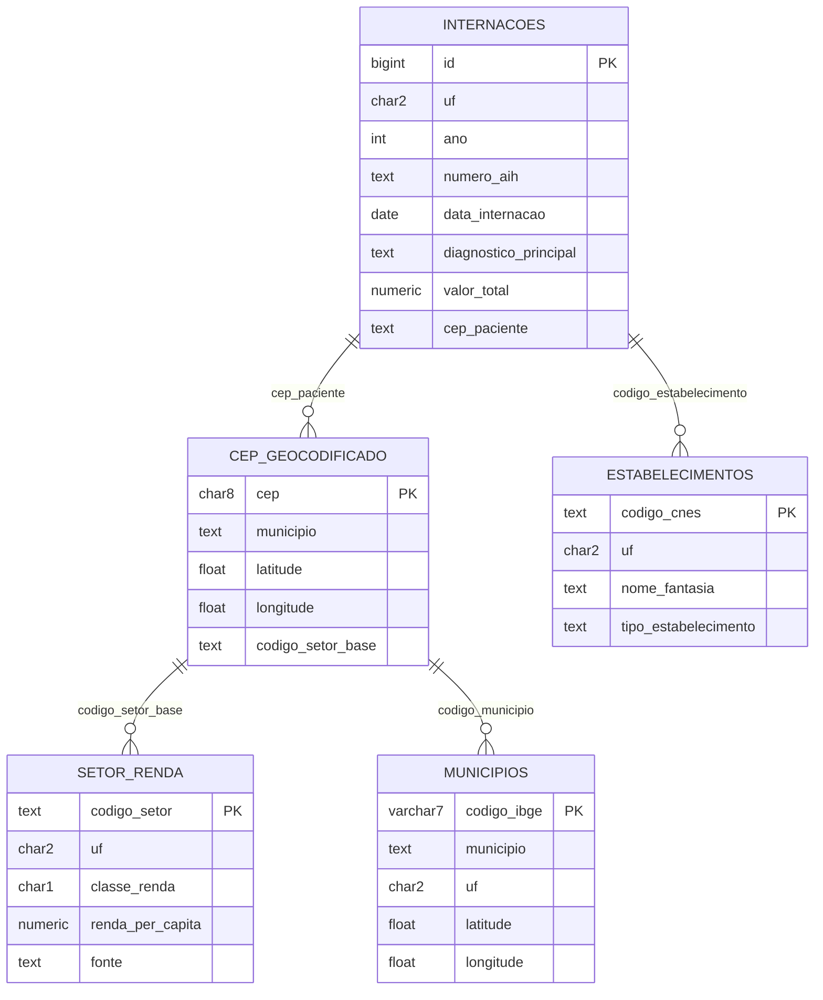

# 📊 Pipeline de Dados Brasileiros

Pipeline robusto de ETL (Extração, Transformação e Carga) para dados públicos brasileiros, com foco em **saúde pública**, **geografia** e **indicadores socioeconômicos**. Transforma dados brutos de fontes oficiais (DATASUS, IBGE, Banco Central) em informações estruturadas e documentadas em PostgreSQL ou CSV.

[](https://opensource.org/licenses/MIT)
[](https://www.python.org/downloads/)
[](https://www.postgresql.org/)

---

## 📋 Índice

- [Visão Geral](#-visão-geral)
- [Casos de Uso](#-casos-de-uso)
- [Arquitetura](#-arquitetura)
- [Fontes de Dados](#-fontes-de-dados)
- [Modelo de Dados](#-modelo-de-dados)
- [Instalação](#-instalação)
- [Configuração](#-configuração)
- [Uso](#-uso)
- [Scripts Utilitários](#-scripts-utilitários)
- [Geocodificação](#-geocodificação)
- [Análise de Renda por Setor](#-análise-de-renda-por-setor)
- [Performance e Otimizações](#-performance-e-otimizações)
- [Contribuindo](#-contribuindo)
- [Licença](#-licença)

---

## 🎯 Visão Geral

Este projeto automatiza a coleta e estruturação de dados públicos brasileiros de múltiplas fontes oficiais. É útil para pesquisadores, cientistas de dados e desenvolvedores que precisam trabalhar com:

- **Dados de Saúde**: Internações hospitalares, estabelecimentos de saúde
- **Dados Geográficos**: Endereços geocodificados, municípios com coordenadas
- **Dados Socioeconômicos**: Renda por setor censitário, indicadores econômicos

### Principais Características

| Característica | Descrição |
|----------------|-----------|
| 🏷️ **Nomes Intuitivos** | Colunas renomeadas de siglas crípticas para nomes legíveis |
| 📖 **Documentação no Banco** | COMMENTs em todas as tabelas + dicionário de dados |
| 🗺️ **Geocodificação** | ~23 milhões de endereços com latitude/longitude |
| ⚡ **Alta Performance** | Uso de `COPY` para inserção em lote, tabelas particionadas |
| 🔄 **Resiliência** | Retry automático com backoff exponencial para downloads |
| 🧹 **Gerenciamento de Memória** | Limpeza automática de cache por período processado |
| 📦 **Flexibilidade** | Exporta para PostgreSQL ou CSV (funciona sem banco) |

---

## 🎓 Casos de Uso

### 1. Pesquisa em Saúde Pública
```sql
-- Internações por diagnóstico e faixa etária
SELECT diagnostico_principal, faixa_etaria, COUNT(*) as total
FROM saude.internacoes
WHERE uf = 'SP' AND ano = 2024
GROUP BY diagnostico_principal, faixa_etaria
ORDER BY total DESC;
```

### 2. Análise Geoespacial
```sql
-- Geocodificar endereços por CEP
SELECT cep, municipio, latitude, longitude
FROM comum.cep_geocodificado
WHERE latitude IS NOT NULL
LIMIT 1000;
```

### 3. Estudos Socioeconômicos
```sql
-- Distribuição de renda por classe
SELECT classe_renda, classe_renda_nome, COUNT(*) as setores
FROM comum.setor_renda
WHERE uf = 'SP'
GROUP BY classe_renda, classe_renda_nome
ORDER BY classe_renda;
```

### 4. Análise Integrada (Saúde + Renda + Geografia)
```sql
-- Taxa de internação por classe de renda
SELECT 
    r.classe_renda_nome,
    COUNT(i.*) as internacoes,
    AVG(i.valor_total) as valor_medio
FROM saude.vw_internacoes_geo i
JOIN comum.cep_geocodificado g ON i.cep_paciente = g.cep
JOIN comum.setor_renda r ON g.codigo_setor_base = r.codigo_setor
GROUP BY r.classe_renda_nome;
```

---

## 🏗️ Arquitetura

O projeto segue uma arquitetura modular e extensível:



### Estrutura de Diretórios

```
ingestao_dados/
├── manage.py              # 🎮 CLI unificada para rodar pipelines
├── config/
│   └── settings.py        # ⚙️ Configurações (UFs, períodos, banco)
├── etl/
│   ├── saude/
│   │   ├── internacoes.py      # Internações hospitalares (SIH-SUS)
│   │   └── estabelecimentos.py # Estabelecimentos de saúde (CNES)
│   └── comum/
│       ├── municipios.py       # Municípios brasileiros (API IBGE)
│       ├── cnefe.py            # Endereços geocodificados (Censo 2022)
│       ├── setor_renda.py      # Renda por setor censitário
│       └── ipca.py             # Índice de inflação (BCB)
├── scripts/
│   ├── setup_project.py   # 🔧 Configuração inicial
│   ├── clean_cache.py     # 🧹 Limpeza de cache
│   └── reset_database.py  # 🗑️ Reset do banco de dados
├── dicionarios/           # 📖 Mapeamento de colunas DATASUS
├── cache/                 # 📦 Arquivos temporários (auto-gerenciado)
├── .env.example           # 📋 Template de configuração
└── requirements.txt       # 📦 Dependências Python
```

---

## 📂 Fontes de Dados

### Dados de Saúde

| Fonte | Origem | Tabela | Volume | Descrição |
|-------|--------|--------|--------|-----------|
| **Internações (SIH-SUS)** | DATASUS FTP | `saude.internacoes` | ~3M/ano (SP) | Todas as internações hospitalares do SUS |
| **Estabelecimentos (CNES)** | DATASUS FTP | `saude.estabelecimentos` | ~100K/mês (SP) | Hospitais, UBS, clínicas, laboratórios |

### Dados Geográficos

| Fonte | Origem | Tabela | Volume | Descrição |
|-------|--------|--------|--------|-----------|
| **Municípios** | API IBGE | `comum.municipios_coordenadas` | 5.571 | Todos os municípios com lat/long (centroide) |
| **Endereços (CNEFE)** | FTP IBGE | `comum.cnefe_enderecos` | ~23M (SP) | Endereços geocodificados do Censo 2022 |
| **CEPs Lookup** | Gerado | `comum.cep_geocodificado` | ~276K (SP) | CEPs únicos com coordenadas médias |

### Dados Socioeconômicos

| Fonte | Origem | Tabela | Volume | Descrição |
|-------|--------|--------|--------|-----------|
| **Renda (Censo 2010+2022)** | FTP IBGE | `comum.setor_renda` | ~165K (SP) | Renda por setor censitário com classificação A-E |
| **IPCA** | API BCB | `comum.ipca_mensal` | ~400 | Índice de inflação para correção monetária |

---

## 📊 Modelo de Dados

### Diagrama de Relacionamentos



### Particionamento (Otimização)

As tabelas de alto volume são **particionadas** para melhor performance:

| Tabela | Particionamento | Benefício |
|--------|-----------------|-----------|
| `saude.internacoes` | UF → ANO | Queries 10x mais rápidas por período |
| `comum.cnefe_enderecos` | UF | Acesso instantâneo por estado |

---

## 🚀 Instalação

### Pré-requisitos

- Python 3.10+
- PostgreSQL 13+ (opcional, pode exportar para CSV)
- ~50GB de espaço livre (para cache temporário)

### Passo a Passo

```bash
# 1. Clone o repositório
git clone https://github.com/Iquitim/brasil-dados-publicos.git
cd brasil-dados-publicos

# 2. Crie ambiente virtual
python3 -m venv venv
source venv/bin/activate  # Linux/Mac
# ou: venv\Scripts\activate  # Windows

# 3. Instale dependências
pip install -r requirements.txt

# 4. Configure credenciais do banco (veja próxima seção)
cp .env.example .env
nano .env  # Edite com suas credenciais

# 5. Execute o setup inicial
python scripts/setup_project.py
```

---

## ⚙️ Configuração

### Credenciais do Banco de Dados

Edite o arquivo `.env` com suas credenciais PostgreSQL:

```bash
# .env
DB_HOST=localhost
DB_NAME=pesquisa
DB_USER=seu_usuario
DB_PASS=sua_senha
DB_PORT=5432
```

> ⚠️ **Importante**: O arquivo `.env` está no `.gitignore` e NÃO será commitado.

### Configuração de Fontes de Dados

Edite `config/settings.py` para definir quais estados e períodos processar:

```python
ETL_CONFIG = {
    # Estados a processar (siglas)
    "padrao": {
        "ufs": ["SP"],  # Adicione mais: ["SP", "RJ", "MG"]
    },
    
    # Período de internações
    "internacoes": {
        "ufs": ["SP"],
        "ano_inicio": 2023,
        "ano_fim": 2025
    },
    
    # Período de estabelecimentos
    "estabelecimentos": {
        "ufs": ["SP"],
        "ano_inicio": 2023,
        "mes_inicio": 1,
        "ano_fim": 2025,
        "mes_fim": 11
    },
}
```

---

## 💻 Uso

### Comando Principal

```bash
# Rodar TODOS os pipelines (ordem otimizada)
python manage.py

# Rodar pipeline específico
python manage.py --sources internacoes
python manage.py --sources cnefe
python manage.py --sources municipios

# Rodar múltiplos pipelines
python manage.py --sources ipca municipios cnefe

# Exportar para CSV (sem banco de dados)
python manage.py --target csv
```

### Ordem de Execução (Automática)

O `manage.py` executa os pipelines na ordem correta de dependências:

1. `ipca` - Índices econômicos (lookup)
2. `municipios` - Municípios brasileiros (para nomes no CNEFE)
3. `estabelecimentos` - Estabelecimentos de saúde
4. `internacoes` - Internações hospitalares
5. `censo_renda` - Renda por setor censitário
6. `cnefe` - Endereços geocodificados

### Exemplo de Saída

```
🚀 Iniciando Pipeline de Dados
🕐 Início: 04/01/2026 16:23:14
🎯 Target: POSTGRES
📦 Sources: all
============================================================

============================================================
▶️  Executando: MUNICIPIOS
============================================================
   📥 Baixando lista de municípios...
   ✅ 5571 municípios encontrados
   ✅ Tabela comum.municipios_coordenadas criada

✅ municipios finalizado com sucesso
⏱️  Tempo: 4.9s

...

============================================================
📊 RESUMO DO PIPELINE
============================================================

⏱️  TEMPO POR FONTE:
----------------------------------------
   ✅ ipca                         1.9s
   ✅ municipios                   4.9s
   ✅ estabelecimentos          14m 28s
   ✅ internacoes               23m 43s
   ✅ censo_renda                 2m 4s
   ✅ cnefe                     11m 22s
----------------------------------------

🕐 Início:    04/01/2026 16:23:14
🕐 Fim:       04/01/2026 17:15:00
⏱️  TOTAL:     51m 46s

🏁 Resultado: 6 sucesso(s) | 0 falha(s)
```

---

## 🛠️ Scripts Utilitários

### Setup Inicial
```bash
python scripts/setup_project.py
```
Cria diretórios necessários e schemas no banco de dados.

### Limpeza de Cache
```bash
# Ver tamanho do cache
python scripts/clean_cache.py

# Limpar cache (com confirmação)
python scripts/clean_cache.py --clean

# Limpar sem confirmação
python scripts/clean_cache.py --force
```

### Reset do Banco de Dados
```bash
# Ver o que será apagado
python scripts/reset_database.py

# Executar reset (com confirmação)
python scripts/reset_database.py --clean

# Reset sem confirmação
python scripts/reset_database.py --force
```

---

## 🗺️ Geocodificação

O projeto inclui um sistema completo de geocodificação de CEPs usando dados do CNEFE (Censo 2022).

### Cobertura

| Estado | CEPs Únicos | Endereços | Cobertura |
|--------|-------------|-----------|-----------|
| SP | 275.658 | 22.953.725 | ~92% |

### Uso

```sql
-- Tabela de lookup rápido
SELECT * FROM comum.cep_geocodificado WHERE cep = '01310100';

-- VIEW pré-configurada para internações geocodificadas
SELECT numero_aih, cep_paciente, municipio_geo, latitude, longitude
FROM saude.vw_internacoes_geo
WHERE latitude IS NOT NULL
LIMIT 100;

-- Função de geocodificação customizada
SELECT * FROM comum.geocodificar('01310100');
```

### Estrutura do CEP Lookup

| Coluna | Tipo | Descrição |
|--------|------|-----------|
| `cep` | CHAR(8) | CEP sem formatação |
| `municipio` | TEXT | Nome do município |
| `latitude` | FLOAT | Latitude média do CEP |
| `longitude` | FLOAT | Longitude média do CEP |
| `codigo_setor_base` | TEXT | Setor censitário (para JOIN com renda) |

---

## 💰 Análise de Renda por Setor

### Classificação de Renda

A tabela `comum.setor_renda` classifica setores censitários em faixas de renda:

| Classe | Nome | Critério (per capita) |
|--------|------|-----------------------|
| E | Extrema pobreza | < 0.5 SM |
| D | Baixa renda | 0.5 - 1 SM |
| C | Classe média baixa | 1 - 2 SM |
| B | Classe média | 2 - 5 SM |
| A | Alta renda | > 5 SM |

> **SM** = Salário Mínimo da época (R$ 510 em 2010, R$ 1.212 em 2022)

### Dados Disponíveis

| Coluna | Fonte | Descrição |
|--------|-------|-----------|
| `renda_per_capita` | Censo 2010 | Renda média total (inclui sem renda) |
| `renda_responsavel_com_renda` | Censo 2010/2022 | Renda dos ocupados |
| `classe_renda` | Calculado | Classificação A-E |
| `fonte` | Metadado | 'CENSO_2010' ou 'CENSO_2022' |

### Integração com Internações

```sql
-- Taxa de óbito por classe de renda
SELECT 
    r.classe_renda,
    r.classe_renda_nome,
    COUNT(*) as internacoes,
    SUM(CASE WHEN i.obito = 'S' THEN 1 ELSE 0 END) as obitos,
    ROUND(100.0 * SUM(CASE WHEN i.obito = 'S' THEN 1 ELSE 0 END) / COUNT(*), 2) as taxa_obito_pct
FROM saude.vw_internacoes_geo i
JOIN comum.cep_geocodificado g ON i.cep_paciente = g.cep
JOIN comum.setor_renda r ON g.codigo_setor_base = r.codigo_setor
WHERE r.fonte = 'CENSO_2010'
GROUP BY r.classe_renda, r.classe_renda_nome
ORDER BY r.classe_renda;
```

---

## ⚡ Performance e Otimizações

### Particionamento de Tabelas

Tabelas de alto volume são particionadas automaticamente:

```
saude.internacoes (tabela principal)
├── internacoes_sp (UF = SP)
│   ├── internacoes_sp_2023 (ANO = 2023)
│   ├── internacoes_sp_2024 (ANO = 2024)
│   └── internacoes_sp_2025 (ANO = 2025)
└── ...

comum.cnefe_enderecos (tabela principal)
├── cnefe_enderecos_sp (UF = SP)
├── cnefe_enderecos_rj (UF = RJ)
└── ...
```

### Benefícios

| Operação | Sem Partição | Com Partição |
|----------|--------------|--------------|
| `SELECT WHERE uf='SP' AND ano=2024` | Scan 8M linhas | Scan 2.5M linhas |
| `DELETE WHERE ano=2023` | Minutos | Segundos (DROP TABLE) |
| `VACUUM` | Tabela inteira | Por partição |

### Resiliência de Rede

Downloads do DATASUS usam **retry automático** com backoff exponencial:

```
Tentativa 1: falha → espera 5s
Tentativa 2: falha → espera 10s
Tentativa 3: falha → espera 20s
Tentativa 4: falha → espera 40s
Tentativa 5: falha → erro
```

### Gerenciamento de Memória

O pipeline limpa cache e força garbage collection após cada ano processado, evitando estouro de memória:

```
Processando 2023... ✅ → limpa cache → gc.collect()
Processando 2024... ✅ → limpa cache → gc.collect()
Processando 2025... ✅ → limpa cache → gc.collect()
```

---

## 🤝 Contribuindo

Contribuições são bem-vindas! Algumas formas de contribuir:

1. **Novos Estados**: Testar/ajustar para outros estados além de SP
2. **Novas Fontes**: Adicionar pipelines para outras bases públicas
3. **Documentação**: Melhorar exemplos e tutoriais
4. **Performance**: Otimizações adicionais

### Para contribuir:

```bash
# 1. Fork o repositório
# 2. Crie uma branch
git checkout -b feature/nova-funcionalidade

# 3. Commit suas mudanças
git commit -m "feat: descrição da mudança"

# 4. Push e abra um Pull Request
git push origin feature/nova-funcionalidade
```

---

## 📄 Licença

Este projeto está licenciado sob a **MIT License** - veja o arquivo [LICENSE](LICENSE) para detalhes.

---

## 📚 Referências

- [DATASUS - Ministério da Saúde](https://datasus.saude.gov.br/)
- [IBGE - Instituto Brasileiro de Geografia e Estatística](https://www.ibge.gov.br/)
- [CNEFE - Censo 2022](https://www.ibge.gov.br/estatisticas/sociais/populacao/22827-censo-demografico-2022.html)
- [Banco Central do Brasil - API](https://dadosabertos.bcb.gov.br/)
- [PySUS - Biblioteca Python para DATASUS](https://github.com/AlertaDengue/PySUS)

---

<p align="center">
  Desenvolvido com ❤️ para a comunidade de dados abertos brasileira
</p>
